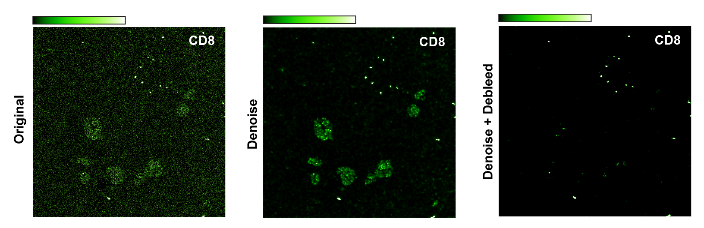
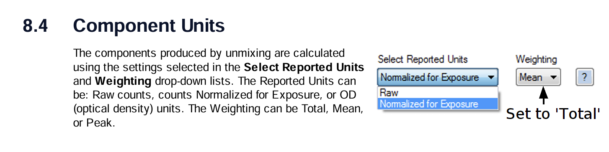

# SpillOT

Highly multiplexed imaging techniques are widely used to study tissue architecture, cell states, and cell-cell interactions, but they can suffer from channel spillover and noise. **SpillOT** is a spillover-removal and denoising toolkit. Available as both a Fiji and python script, SpillOT provides user-guided removal of suspected spillover in highly multiplexed image stacks.

Unlike ordinary linear compensation, SpillOT does not simply subtract one channel globally from another. Instead, the user specifies which channels may be spilling into which target channels, and SpillOT removes signal only where its structural patch-similarity logic detects matching local image structure.



## Contents

- [Fiji plugin](#fiji-plugin)
  - [Quick start](#quick-start)
  - [How to run SpillOT in Fiji](#how-to-run-spillot-in-fiji)
  - [Manual spillover CSV](#manual-spillover-csv)
  - [Outputs](#outputs)
  - [Command-line use](#command-line-use-terminal--cluster)
  - [Opal / Vectra export note](#opal--vectra-export-note)
- [Denoiser](#denoiser)
  - [Multi-channel data](#multi-channel-data)
  - [2D data](#2d-data)
  - [Reproducibility](#reproducibility)
- [Optional mode: DetectChannels](#optional-mode-detectchannels)
- [Troubleshooting](#troubleshooting)
- [FAQ](#faq)

---

# Fiji plugin

Our first plugin is intended for cases where the user knows, or wants to specify, which channels are plausible sources of bleed-through into each target channel. For example, if signal from `Ki67` appears to spill into `CD8`, the user can mark `Ki67` as a channel to remove from `CD8`. SpillOT will then remove `Ki67`-like signal from `CD8` only in image patches where the structural patch-similarity detector flags a match.

## Quick start

### 1) Install Fiji and Anaconda or Miniconda

- Download Fiji from https://fiji.sc/ and install it.
- If you do not already have Anaconda or Miniconda, install one of them. Anaconda installation instructions are available here: https://docs.anaconda.com/anaconda/install/.

### 2) Create a conda environment named `spillot`

Run the following in a terminal or Anaconda Prompt:

```bash
conda create -n spillot -c conda-forge python=3.11 numpy scipy tifffile imagecodecs
conda activate spillot
python -c "import numpy, scipy, tifffile; print('SpillOT env OK')"
```

### 3) Install the SpillOT Fiji plugin

Download this repository by clicking **Code → Download ZIP** on GitHub, then unzip it.

Copy the SpillOT plugin folder into your Fiji plugins directory. In this repository, the folder is:

```text
plugins/SpillOT/
```

Restart Fiji, or use:

```text
Help → Refresh Menus
```


---

## How to run SpillOT in Fiji

1. Open your image in Fiji as a TIFF stack where each slice or channel corresponds to one marker/channel.

   For some proprietary biological imaging formats, you may need to use:

   ```text
   Plugins → Bio-Formats → Bio-Formats Importer
   ```

   If Bio-Formats opens one image per channel, combine them into a single stack using:

   ```text
   Image → Stacks → Images to Stack…
   ```

2. Run SpillOT:

   ```text
   Plugins → SpillOT → SpillOT
   ```

   If it does not appear, open `SpillOT_.py` in the Fiji Script Editor and click **Run**, or use **Help → Refresh Menus**.

3. Select which channels you want to clean.

   This first menu asks which target channels should be processed.

4. For each selected target channel, choose which other channels you suspect are bleeding into that target.

   In this menu, the selected target channel is shown on the left, and candidate spillover/source channels are shown on the right. Check any channel that may be contributing spillover into the selected target. SpillOT will remove checked channels from that target only where the structural patch-similarity logic detects a local match.

5. Enter run settings.


**Patch size**: must be an even integer greater than or equal to 4. The default is `16` and this usally works well. Smaller patch sizes are usually more aggressive and faster. Larger patch sizes are for slower and more gentle correction.

   The dialog also asks for the path to the `spillot` conda environment. The plugin tries to prefill this. If the field is blank, paste the full path to your `spillot` environment. See the FAQ for examples.

6. Click **OK** to start.

A progress window will show elapsed time while channels are processed.

---

## Outputs

SpillOT writes outputs next to the input TIFF.

For each selected target channel `N`, it writes a per-channel output:

```text
<stack_basename>_Channel_<N>_SpillOT.tif
```

It also writes a full replacement stack:

```text
<stack_basename>_SpillOT.tif
```

The full-stack output is the original stack with selected channels replaced by their SpillOT-cleaned versions. Channels not selected for cleaning are left unchanged.

The output datatype is matched back to the input datatype when possible, and outputs are ImageJ-compatible TIFFs.

---

## Command-line use: terminal / cluster

SpillOT can also be run outside Fiji, for example on a workstation or compute cluster. Use the same backend runner that Fiji calls:

```text
plugins/SpillOT/SpillOT.py
```

### Basic terminal usage

From the repository root:

```bash
conda activate spillot
python plugins/SpillOT/SpillOT.py <path/to/stack.tif> <channel>
```

Example, processing channel 21:

```bash
conda activate spillot
python plugins/SpillOT/SpillOT.py IMC_smallcrop/IMC_smallcrop.tif 21
```

Channel indexing is **1-based**, so `21` means the 21st channel in the TIFF stack.

To process all channels, omit the channel number:

```bash
python plugins/SpillOT/SpillOT.py IMC_smallcrop/IMC_smallcrop.tif
```
### Manual spillover CSV

SpillOT uses a manual spillover matrix to record which source channels should be considered for removal from each target channel.

The matrix convention is:

```text
row    = target channel to clean
column = channel suspected of bleeding/spilling into that target
1      = remove this column's channel from this row's channel where patches match
```

Channel names in the header row and first column are optional. If names are included, SpillOT will use them when possible. If names are left blank, the matrix is interpreted by order: the first data row is channel 1, the second data row is channel 2, and so on, with columns following the same channel order.

For example:

```csv
,HLA-ABC,CD57,CD31,Ki67
HLA-ABC,,1,,
CD57,,,,
CD31,,,,1
Ki67,,,,
```

The same matrix can also be written without channel names if you prefer to rely only on channel order:

```csv
,,,,
,,1,,
,,,,
,,,,1
,,,,
```

This means:

- remove `CD57` from `HLA-ABC` wherever SpillOT detects structurally similar patches;
- remove `Ki67` from `CD31` wherever SpillOT detects structurally similar patches;
- leave channel pairs that are not marked with `1` unchanged.

By default, SpillOT looks for a same-name CSV next to the input TIFF:

```text
<stack_basename>.csv
```

You can also specify a CSV explicitly:

```bash
python plugins/SpillOT/SpillOT.py <path/to/stack.tif> 21 --csv <path/to/spillover_matrix.csv>
```

The aliases `--manual_csv` and `--manual-csv` are also accepted.

As an alaternative to manually creating a csv, going through the first three menus of our Fiji plugin will auto generate a properly formatted csv with your channel speicfications, and save it next to your image stack, which can then be read by the cluster script.

### Patch size

Set patch size with:

```bash
python plugins/SpillOT/SpillOT.py <path/to/stack.tif> 21 --patsize 12
```

or:

```bash
python plugins/SpillOT/SpillOT.py <path/to/stack.tif> 21 -p 12
```

Patch size must be an even integer greater than or equal to 4. The default is `16`.

### Ignore overexposed pixels

To set saturated pixels to zero before processing and inpaint them afterward:

```bash
python plugins/SpillOT/SpillOT.py <path/to/stack.tif> 21 --ignore_overexposed
```

This is rarely needed, but can be useful when saturated pixels are causing artefacts.

---

## Opal / Vectra export note

SpillOT expects input as a TIFF stack where each slice is one marker/channel.

If your data starts as an Opal/Vectra `.mif`, we recommend exporting unmixed component/composite images from inForm using these settings:

- **Select Reported Units**: **Normalized for Exposure**
- **Weighting**: **Total**



Make sure you export unmixed component channels, not an RGB-rendered image. Depending on your inForm export, you may get either:

- one multi-page TIFF / stack, or
- one TIFF per channel.

If you get one TIFF per channel, stack them in Fiji using:

```text
Image → Stacks → Images to Stack…
```

Make sure the channel order matches the row/column order of any CSV matrix you use.

---

# Denoiser

## Multi-channel data

The denoiser is not part of the Fiji plugin, but you can run it from the command line. We first need to install pytorch to our env though. Follow the instructions here to get a command you can enter to install pytorch: https://pytorch.org/get-started/locally/. If you have a GPU, select one of the compute platforms that starts with `CUDA`. The command the website gives you should start with `pip3`. Enter that command into the terminal and press enter.

The denoiser can be run from the command line in a similar way:

```bash
cd <masterdirectoryname>
conda activate spillot
python denoise.py IMC_smallcrop/IMC_smallcrop.tif 21
```

This should take under 30 minutes to run on a GPU with more than 32 GB of memory.

## 2D data

To denoise 2D images, create a folder in the master directory and put your noisy images into it. Then open an Anaconda Prompt or terminal and run the following:

```bash
cd <masterdirectoryname>
conda activate spillot
python denoise2D.py <noisyfolder>/<noisyimagename>
```

Replace `masterdirectoryname` with the full path to the directory that contains `denoise2D.py`, replace `noisyfolder` with the name of the folder containing images you want denoised, and replace `noisyimagename` with the name of the image file you want denoised. Results will be saved to the directory `<noisyfolder>_denoised`. Issues may arise if using an image format that is not supported by the `tifffile` Python package. To fix these issues, open your images in ImageJ and re-save them as `.tif`, even if they were already `.tif`; this will convert them to ImageJ TIFF.

## Reproducibility

To run anything beyond this point in the README, install another conda library:

```bash
conda install anaconda::scikit-image=0.23.2
```

### Using SpillOT denoise on provided datasets

To run SpillOT denoise on one of the noisy microscope images, open a terminal in the master directory and run:

```bash
cd <masterdirectoryname>
python denoise2D.py Microscope_gaussianpoisson/1.tif
```

The denoised results will be in the directory `Microscope_gaussianpoisson_denoised`.

To run SpillOT denoise on the other datasets, first add synthetic Gaussian noise. For example, to test SpillOT denoise on Set12 with sigma=25 Gaussian noise, first run:

```bash
cd <masterdirectoryname>
python add_gaussian_noise.py Set12 25
```

This will create the folder `Set12_gaussian25`, which can now be denoised:

```bash
python denoise2D.py Set12_gaussian25/01.tif
```

The denoised results will be returned in a folder named `Set12_gaussian25_denoised`.

### Calculate accuracy of SpillOT denoise

To find the PSNR and SSIM between a folder containing denoised results and the corresponding folder containing known ground truths, such as `Set12_gaussian25_denoised` and `Set12`, install one more conda package:

```bash
conda activate spillot
conda install -c anaconda scikit-image=0.19.2
```

Now measure accuracy with:

```bash
cd <masterdirectoryname>
python compute_psnr_ssim.py Set12_gaussian25_denoised Set12 255
```

You can replace `Set12` and `Set12_gaussian25` with any pair of denoised/ground-truth folders. Order does not matter. Average PSNR and SSIM will be returned for the entire set.

The `255` at the end denotes the dynamic range of the image. For 8-bit images from Set12, `255` is a sensible value. For the Microscope data, `700` is a more sensible value and will replicate the results from our paper.

### Running compared methods

We can run DIP, Noise2Self, P2S, and N2F+DOM in the SpillOT environment:

```bash
conda activate spillot
python DIP.py Microscope_gaussianpoisson
python N2S.py Microscope_gaussianpoisson
python P2S.py Microscope_gaussianpoisson
python N2FDOM.py Microscope_gaussianpoisson
```

---

# Optional mode: DetectChannels

The repository also includes **DetectChannels** as an optional mode. Use DetectChannels when you want the software to help detect which channels are bleeding through into which other channels using the older keep-the-brightest or signal-based logic.

DetectChannels uses a co-expression / exclusion matrix rather than SpillOT's manual source-to-target removal matrix. Its matrix convention is:

```text
1 or -1 = keep / allow comparison
0 or blank = exclude / veto comparison
```

DetectChannels can use this matrix to pre-propose co-expressing groups and to prevent biologically co-expressed channels from being treated as bleed-through sources.

## Running DetectChannels in Fiji

Copy the `DetectChannels` folder from the repository into Fiji's plugins folder so that it contains:

```text
Fiji.app/plugins/DetectChannels/DetectChannels_.py
Fiji.app/plugins/DetectChannels/DetectChannels.py
Fiji.app/plugins/DetectChannels/keep_the_brightest.py
Fiji.app/plugins/DetectChannels/signal_based.py
```

Restart Fiji or use:

```text
Help → Refresh Menus
```

The menu item should appear as:

```text
Plugins → DetectChannels → DetectChannels
```

Run DetectChannels if your goal is automatic detection of candidate bleed-through channel relationships. Run SpillOT if you want to manually specify exactly which channels may be removed from each target channel.

---

# Troubleshooting

## SpillOT does not appear in the Fiji Plugins menu

Check that the visible launcher file is named:

```text
SpillOT_.py
```

and is inside your Fiji plugins folder, for example:

```text
Fiji.app/plugins/SpillOT/SpillOT_.py
```

Then restart Fiji or use:

```text
Help → Refresh Menus
```

If it still does not appear, open `SpillOT_.py` in Fiji's Script Editor and click **Run**.

## The plugin cannot find Python or the conda environment

Make sure the `spillot` environment exists:

```bash
conda activate spillot
python -c "import numpy, scipy, tifffile; print('SpillOT env OK')"
```

If Fiji does not automatically find it, paste the full environment path into the dialog.

Typical paths look like:

```text
macOS/Linux: /Users/<user>/miniconda3/envs/spillot
macOS/Linux: /opt/anaconda3/envs/spillot
Windows: C:\Users\<user>\miniconda3\envs\spillot
Windows: C:\ProgramData\Anaconda3\envs\spillot
```

## My CSV is not being used

Make sure either:

1. the CSV has the same base name as the TIFF and is in the same folder, or
2. you pass it explicitly with `--csv` in terminal mode.

Example same-name pair:

```text
sample_stack.tif
sample_stack.csv
```

Also confirm the matrix has the same channel order as the TIFF stack. Header names are helpful but not required; row and column order are the most important.

## SpillOT ran but nothing changed

Common causes:

- the selected target channel row has no `1` entries in the CSV;
- the first Fiji menu did not include the target channel you expected to process;
- the checked source channels did not pass the structural patch-similarity detector;
- the image is not a channel-by-channel TIFF stack.

## Windows MKL error such as `mkl_intel_thread.2.dll not found`

Option 1: switch NumPy or SciPy to OpenBLAS builds:

```bat
conda activate spillot
conda install -y -c conda-forge "blas=*=openblas" numpy scipy
```

Or keep MKL by installing the MKL runtime and ensuring DLL search works:

```bat
conda activate spillot
conda install -y -c defaults mkl intel-openmp mkl-service
set CONDA_DLL_SEARCH_MODIFICATION_ENABLE=1
```

The plugin adds `<env>\Library\bin` to PATH for the child process on Windows.

---

# FAQ

## Should I use SpillOT or DetectChannels?

Use **SpillOT** when you want direct control over which channels may be removed from which target channels. The CSV explicitly records every user-approved source-to-target channel pair.

Use **DetectChannels** if you specifically want the older automatic channel-relationship detection workflow.

## Does SpillOT perform linear compensation?

No. SpillOT does not globally subtract one channel from another. It uses the user-provided channel-pair matrix to decide which source channels are eligible, then removes signal only in local patches where the structural patch-similarity detector finds a match.

## Are channel numbers 0-based or 1-based?

User-facing channel numbers are **1-based** in Fiji and terminal commands. CSV rows and columns follow the TIFF stack order.


## Where is my conda environment installed?

Run:

```bash
conda env list
```

Use the full path shown for `spillot`.

Examples:

```text
macOS: /opt/anaconda3/envs/spillot or ~/miniforge3/envs/spillot
Windows: C:\Users\<you>\miniconda3\envs\spillot or C:\Users\<you>\anaconda3\envs\spillot
Linux: ~/mambaforge/envs/spillot or ~/miniconda3/envs/spillot
```

## Can I use Mambaforge or Miniforge?

Yes. The plugin only needs the env root path and the env must contain Python, NumPy, SciPy, and tifffile.

## Which packages are required for the Fiji spillover-removal plugin?

Required:

```text
python=3.11
numpy
scipy
tifffile
```

Optional but useful:

```text
imagecodecs
```

`imagecodecs` is optional but helps with wider TIFF codec support.

## Does the Fiji plugin use a GPU?

No. The Fiji spillover-removal plugin is CPU-based. The separate denoiser scripts can use a GPU.
